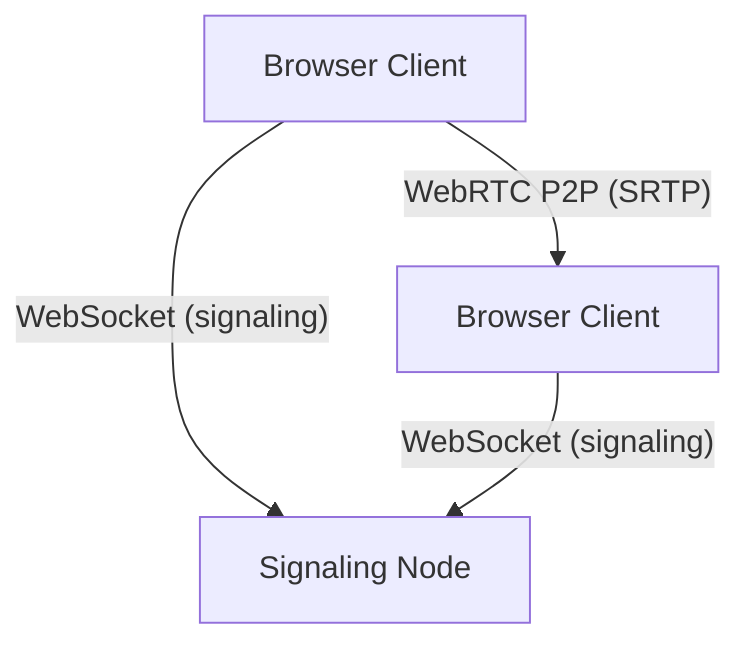
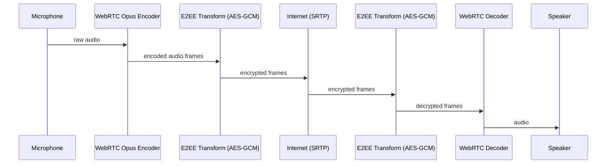

# Open Radio (decentralized walkie‑talkie)

Open Radio is an **open-source, privacy-focused, anonymous, decentralized-ish** global “digital walkie‑talkie” network.

- **No accounts**: clients generate ephemeral IDs (rotated periodically)
- **Rooms = frequencies**: join by shared secret string (e.g. `darkforest-773`)
- **Real-time voice**: low-latency WebRTC audio with push‑to‑talk
- **End-to-end encryption (E2EE)**: audio frames are encrypted with a key derived from the frequency
- **No central voice server**: voice never touches the signaling node (only SDP/ICE exchange)

> Important: The signaling node is a *bootstrap / rendezvous service* for peer discovery and WebRTC connection setup. It does **not** store messages and does **not** carry voice media.

---

## Architecture (high level)

### Components

- **`client/`**: Next.js web app
  - Captures microphone
  - Creates WebRTC mesh connections to peers in the same frequency
  - Uses WebRTC **Insertable Streams** to E2EE-encrypt encoded audio frames with a key derived from the frequency
  - Maintains **presence** via data channels (heartbeats) to show listener count

- **`signaling/`**: Node.js WebSocket signaling server
  - Peers join `frequencyHash`
  - Server returns current peers and relays signaling messages (`offer`, `answer`, `ice`)
  - Keeps only in-memory room membership (no DB)

### Network flow (voice path)

```
Mic -> WebRTC encoder (Opus) -> E2EE transform (AES-GCM) -> SRTP -> Internet -> SRTP -> E2EE decrypt -> WebRTC decoder -> Speaker
```

### Signaling flow (setup only)

```
Browser A --WS--> signaling --WS--> Browser B
  offer/answer/ice relayed only
```

---

## Folder structure

```
open-radio/
  client/                 # Next.js web client (React UI + WebRTC + E2EE)
  signaling/              # WebSocket bootstrap/signaling node
  docker-compose.yml      # Run both together locally
  LICENSE
  README.md
```

---

## Run locally (recommended)

### Prereqs

- Node.js 20+ (or 18+)
- A modern Chromium-based browser (Chrome/Edge) for E2EE Insertable Streams
  - Firefox/Safari will still connect, but may fall back to non-E2EE (configurable)

### 1) Start signaling node

In one terminal:

```bash
cd open-radio/signaling
npm install
npm run dev
```

The signaling server listens on `ws://localhost:8787` by default.

### 2) Start the client

In another terminal:

```bash
cd open-radio/client
npm install
npm run dev
```

Open `http://localhost:3000` in two different browsers/tabs, enter the same frequency, and use **PRESS TO TALK**.

### Access from another PC on your LAN (important: use HTTPS)

If you open the site from another machine using `http://192.168.x.x:3000`, browsers will typically disable **WebCrypto** (`crypto.subtle`) because it’s **not a secure context**. Open Radio needs WebCrypto for room key derivation and E2EE.

Also: an HTTPS page cannot connect to insecure `ws://` WebSockets (mixed content). So for LAN HTTPS you should proxy **both**:
- the Next.js UI (HTTP) and
- the signaling WebSocket (WS)

behind a single HTTPS endpoint (Nginx).

#### Nginx HTTPS reverse proxy (LAN)

1) Run the app locally as usual:

```bash
cd open-radio/signaling
npm run dev
```

```bash
cd open-radio/client
npm run dev
```

2) Install Nginx on the machine hosting Open Radio.

3) Create a self-signed cert (you can use OpenSSL from Git for Windows). Example:

```bash
openssl req -x509 -newkey rsa:2048 -nodes -days 365 ^
  -keyout key.pem -out cert.pem ^
  -subj "/CN=192.168.1.42" ^
  -addext "subjectAltName=IP:192.168.1.42,DNS:localhost"
```

4) Use this Nginx config (replace `192.168.1.42` and paths; listen on 8443 to avoid admin rights):

```nginx
events {}
http {
  map $http_upgrade $connection_upgrade {
    default upgrade;
    '' close;
  }

  server {
    listen 8443 ssl;
    server_name 192.168.1.42;

    ssl_certificate     /path/to/cert.pem;
    ssl_certificate_key /path/to/key.pem;

    # Next.js UI
    location / {
      proxy_pass http://127.0.0.1:3000;
      proxy_http_version 1.1;
      proxy_set_header Host $host;
      proxy_set_header Upgrade $http_upgrade;
      proxy_set_header Connection $connection_upgrade;
    }

    # Signaling WebSocket (proxied as WSS)
    location /signal {
      proxy_pass http://127.0.0.1:8787;
      proxy_http_version 1.1;
      proxy_set_header Upgrade $http_upgrade;
      proxy_set_header Connection $connection_upgrade;
      proxy_set_header Host $host;
    }
  }
}
```

5) Start Nginx, then on the other PC open:

- `https://192.168.1.42:8443`

Accept the cert warning (development only). Joining a frequency should now work.

#### Next.js experimental HTTPS dev server

Next.js can also run HTTPS directly, but on Windows it may hang on certificate prompts:

```bash
cd open-radio/client
npm run dev:https
```

Then open `https://192.168.x.x:3000` on the other PC and accept the certificate warning.

If `npm run dev:https` hangs on Windows (mkcert prompt), use one of these alternatives:

- **Option 1 (recommended):** run the client on the other PC too (each PC uses `http://localhost:3000`, and both point to the same public signaling server)
- **Option 2:** put the client behind a local reverse proxy that terminates TLS (Caddy/Nginx) and proxies to `http://127.0.0.1:3000`

### Quick test plan (2 browsers)

1. Open `http://localhost:3000` in **two** windows (or two machines).
2. Use the **same frequency** (try a longer secret like `ocean-stand-razor-9931-7f2c`).
3. Confirm:
   - **Listeners** increases to 2
   - Both peers show **connected**
   - Holding **Space** (or the button) in one window produces audible audio in the other
   - The peer dot turns green while someone is speaking

### Anonymous ID rotation

Clients automatically **rotate their peer ID** by reconnecting every ~20 minutes.

---

## Run with Docker

From `open-radio/`:

```bash
docker compose up --build
```

- client: `http://localhost:3000`
- signaling: `ws://localhost:8787`

> Note (Windows): Some environments restrict creation of `.next/trace`, which can break `npm run build` on Windows drives with aggressive security/AV policies. If that happens, use `npm run dev` or Docker (Docker builds in Linux and is unaffected).

---

## Deploy globally (so anyone can join worldwide)

You only need to deploy the **signaling node** somewhere publicly reachable (VPS, Fly.io, Render, Railway, etc.).

Then run the client with:

- `NEXT_PUBLIC_SIGNALING_URL=wss://your-domain.example`

Notes:

- For best NAT traversal, browsers use public STUN by default. For tougher networks, add a TURN server and set `NEXT_PUBLIC_TURN_URL`, `NEXT_PUBLIC_TURN_USERNAME`, `NEXT_PUBLIC_TURN_PASSWORD`.

### Railway (monorepo notes)

This repository is a monorepo. On Railway, deploy the signaling service with:

- **Root directory**: `signaling`
- **Builder**: Nixpacks
- **Env**: `ALLOW_ORIGINS=*`

If Railway logs show `npm: not found`, set a service variable:

- `NIXPACKS_CONFIG_FILE=nixpacks.toml`

(`signaling/nixpacks.toml` forces Node.js + npm in the build image.)

---

## Security & privacy model

- **Room secrecy**: the frequency string is the shared secret. Anyone who knows it can join.
- **Key derivation**: `roomKey = SHA-256(frequency)` and expanded to AES‑GCM key material.
- **E2EE**: WebRTC encoded audio frames are encrypted/decrypted in the browser before/after WebRTC transport.
- **No identities**: clients generate random IDs and rotate them periodically by reconnecting.
- **No message storage**: signaling server only forwards setup messages; it does not store voice, and does not persist membership.

Threats / limitations (important):

- **Room name guessing**: weak frequencies are guessable. Use long, random frequencies for privacy.
- **Traffic analysis**: observers can still see you connected to the signaling server and peers; E2EE protects content, not metadata.
- **Mesh scaling**: full-mesh WebRTC doesn’t scale to huge rooms. This is designed for small-to-medium groups.

---

## Diagrams

### Component diagram



### Data diagram (E2EE)



